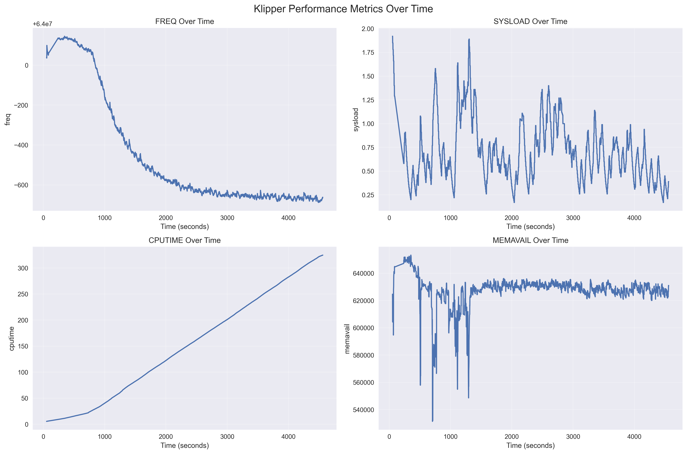
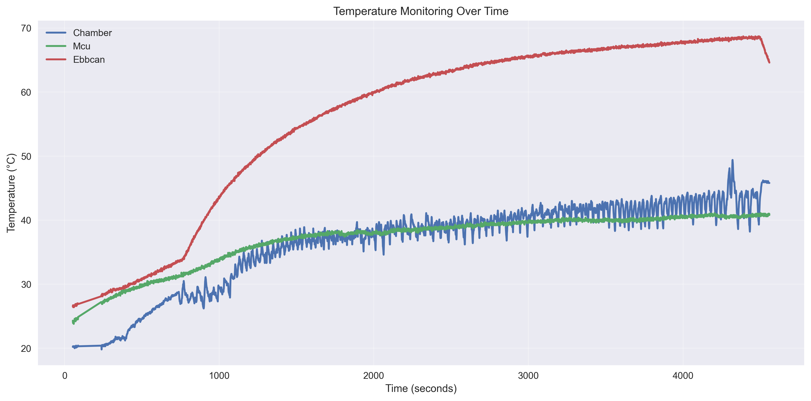
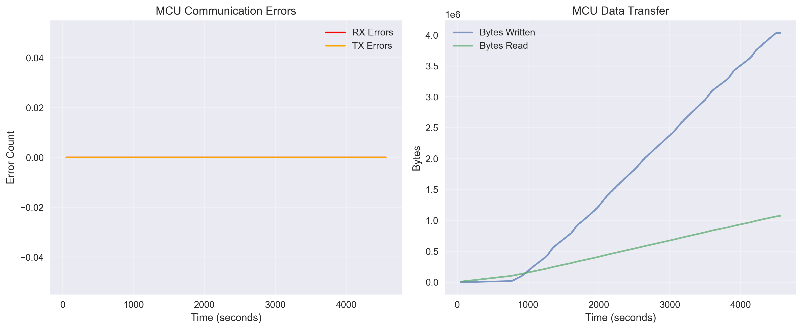

# Klipper Log Analyzer

A comprehensive Python tool for analyzing Klipper 3D printer log files to provide insights into system performance, temperature monitoring, MCU communication health, and error analysis.

## Features

- **Performance Analysis**: Monitor system load, CPU time, memory usage, and frequency metrics
- **Temperature Tracking**: Track and visualize extruder, bed, and other sensor temperatures over time
- **MCU Communication Health**: Analyze communication errors and data transfer rates
- **Error Detection**: Parse and categorize errors, warnings, and exceptions from logs
- **Data Visualization**: Generate comprehensive charts and graphs showing system behavior
- **Health Reports**: Generate detailed text reports with recommendations
- **Data Export**: Export analyzed data to CSV and JSON formats

## Requirements

- Python 3.7+
- matplotlib >= 3.5.0
- pandas >= 1.3.0
- seaborn >= 0.11.0
- numpy >= 1.21.0

## Installation

1. Clone or download this repository
2. Install the required dependencies:

```bash
pip install -r requirements.txt
```

## Usage

### Basic Analysis

Analyze a Klipper log file and generate all reports and visualizations:

```bash
python klipper_log_analyzer.py /path/to/klippy.log
```

### Command Line Options

- `--output-dir`, `-o`: Specify output directory for reports and visualizations (default: current directory)
- `--extract-stats`: Extract all stats lines to a separate file
- `--no-plots`: Skip generating visualization plots
- `--report-only`: Generate only the text health report

### Examples

```bash
# Analyze log and save outputs to 'analysis' directory
python klipper_log_analyzer.py klippy.log -o analysis

# Extract just the stats lines to a file
python klipper_log_analyzer.py klippy.log --extract-stats stats_output.txt

# Generate only health report (no visualizations or data exports)
python klipper_log_analyzer.py klippy.log --report-only

# Skip plot generation but export data
python klipper_log_analyzer.py klippy.log --no-plots
```

## Output Files

The analyzer generates several output files:

- `health_report.txt`: Comprehensive text report with system analysis and recommendations
- `performance_report.json`: Detailed performance metrics in JSON format
- `klipper_stats_data.csv`: All parsed statistics data in CSV format
- `klipper_mcu_configs.json`: MCU configuration information
- `klipper_errors.json`: Parsed errors and warnings
- `klipper_performance_metrics.png`: System performance charts
- `klipper_temperatures.png`: Temperature monitoring graphs
- `klipper_mcu_communication.png`: MCU communication health charts

## Example Visualizations

### Performance Metrics


The performance metrics chart shows system load, CPU time, memory availability, and frequency over time, helping identify performance bottlenecks and system stress periods.

### Temperature Monitoring


Temperature charts track extruder, bed, and other sensor temperatures throughout the print, helping identify heating issues and temperature stability.

### MCU Communication Health


Communication health charts show error rates and data transfer statistics, helping diagnose connectivity issues between the host and MCU.

## Health Report Features

The health report analyzes:

- **MCU Information**: Commands loaded, moves configured, firmware versions
- **Performance Summary**: Runtime, statistics frequency, system load analysis
- **Error Analysis**: Categorized errors with occurrence counts
- **Communication Health**: RX/TX error detection
- **Temperature Analysis**: Min/max/average temperatures with warnings
- **Recommendations**: Actionable suggestions based on analysis

## Data Analysis Capabilities

### Performance Metrics
- System load monitoring with high-load warnings
- CPU time analysis
- Memory usage tracking with low-memory alerts
- Frequency stability analysis

### Temperature Monitoring
- Multi-sensor temperature tracking
- Temperature stability analysis
- High-temperature warnings for extruders and beds
- Target vs actual temperature comparison

### MCU Communication
- Communication error detection
- Data transfer rate analysis
- Connection stability monitoring

## Example Output Structure

```
analysis/
├── health_report.txt           # Main health report
├── performance_report.json    # Detailed metrics
├── klipper_stats_data.csv     # Raw statistics
├── klipper_mcu_configs.json   # MCU configurations
├── klipper_errors.json        # Error log
├── klipper_performance_metrics.png
├── klipper_temperatures.png
└── klipper_mcu_communication.png

resources/                      # Example outputs
├── klipper_performance_metrics.png
├── klipper_temperatures.png
└── klipper_mcu_communication.png
```

## Log Format Support

The analyzer parses standard Klipper log formats including:
- Statistics lines (`Stats X.X: ...`)
- MCU loading messages
- Configuration sections
- Error and warning messages
- Temperature readings
- Communication statistics

## Contributing

Contributions are welcome! Please feel free to submit pull requests or open issues for bugs and feature requests.

## License

This project is open source. Please check the repository for specific license information.